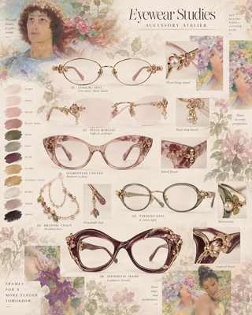

# Editorial Eyewear — Geometry Nodes Breakdown

These sheets are **design references, not manufacturing/CAD specifications**. They support the owner-authored Accessory Atelier eyewear lane and are meant to translate visual motifs into a reusable Blender Geometry Nodes modelling system for web-ready proof assets.

## Design sheets

### Romantic atelier

Antique-gold / shell / dusty-rose direction; floral filigree, rimless accents, pearls and sculptural acetate.

### Modern editorial

Silver / smoke / lilac / black-cherry direction; cleaner geometry, translucent acetate, gemstone details and chains.

## GN system: one frame, six families

The useful abstraction is **not six separate procedural glasses generators**. Build one controllable frame rig whose outputs can be art-directed into the six silhouette families shown in the studies.

### 1. `GN_Eyewear_Frame`

**Inputs**

- `Lens Width`
- `Lens Height`
- `Lens Corner / Roundness`
- `Lens Tilt`
- `Bridge Width`
- `Bridge Height`
- `Frame Thickness`
- `Frame Depth`
- `Wrap Angle`
- `Cat Eye Lift`
- `Symmetry Offset`

**Core graph**

1. Start from one owner-edited 2D lens curve or a small parametric curve profile.
2. Resample Curve for stable downstream density.
3. Apply silhouette shaping before mirroring: oval / soft rectangle / cat-eye lift.
4. Curve to Mesh with a compact bevel/profile curve for the rim.
5. Mirror the lens around the face centreline.
6. Generate the bridge from the two inner lens anchor points rather than eyeballing a separate mesh.
7. Realize only at the export boundary; keep editable curves upstream.

**Why:** silhouette remains an art decision while thickness, symmetry and web-resolution become repeatable.

### 2. `GN_Eyewear_Temple`

**Inputs**

- `Temple Length`
- `Temple Bend Start`
- `Ear Drop`
- `Temple Width`
- `Temple Taper`
- `Tip Scale`
- `Hinge Offset`

Build each temple from a curve anchored to a named hinge point. Use Set Curve Radius / profile scaling for taper instead of dense hand-edited mesh loops. A short final control section should remain hand-adjustable for fit and silhouette.

Keep hinge **appearance** procedural, but do not imply working optical/mechanical tolerances. This lane is presentation geometry, not manufacturing CAD.

### 3. `GN_Eyewear_OrnamentScatter`

Use named curves / vertex groups as ornament masks rather than scattering decoration across the whole frame.

**Inputs**

- `Ornament Density`
- `Ornament Scale`
- `Seed`
- `Side Bias`
- `Bloom Rotation`
- `Pearl Ratio`
- `Leaf Ratio`
- `Gem Ratio`

Suggested flow:

`named ornament guide curve -> resample -> curve tangent -> instance on points -> align Euler to vector -> controlled random rotation/scale -> realize on export`

Maintain a **small owner-authored motif library**: bloom, leaf, pearl seat, marquise gem, tiny vine connector. Instance these; do not proceduralize the motifs themselves unless a real modelling need appears.

### 4. `GN_Eyewear_Chain`

For the Melodic Chain / Nymph language:

1. hand-draw one drape curve;
2. resample at link spacing;
3. Instance on Points for a low-poly link or bead module;
4. align to curve tangent;
5. optionally alternate link rotation by index;
6. expose a `Charm Mask` for sparse flower/pearl drops.

For web GLB delivery, prefer a visually convincing low-link-count chain or curve-to-mesh strand over hundreds of literal jewellery links.

### 5. Lens + rim separation

Do **not** fuse lens and frame merely because GN can do it. Keep outputs separated by material role:

- `FRAME_METAL`
- `FRAME_ACETATE`
- `LENS`
- `ORNAMENT_METAL`
- `GEM`
- `PEARL`
- `CHAIN`

That preserves the current browser material strategy and lets the Three.js viewer tune transmission, roughness, metallic response and tint independently.

## Silhouette recipes

| Study family | GN emphasis | Owner art pass |
| --- | --- | --- |
| Lyrical / Aurora oval | high roundness, thin profile, low cat-eye lift | hinge flower + bridge proportion |
| Petal rimless / Flora | no full rim or minimal rim, delicate bridge | lens shape + micro ornament placement |
| Florentine / Obsession cat-eye | strong cat-eye lift, thicker acetate depth | sculpted brow line + embedded floral treatment |
| Verdant / Lorelei | restrained round/rectangle hybrid | translucent acetate colour + pearl/leaf hinge |
| Seraph | soft rectangle, smoke acetate, heavier temple | gem setting + chain attachment detail |
| Aphrodite statement | asymmetrical or exaggerated silhouette controls | hand-sculpted hero frame; GN only supports repeatable thickness/ornament anchors |

## Material / lookdev targets

The studies point to a limited palette rather than dozens of variants:

- ivory / pearl
- shell / blush
- dusty rose / rose quartz
- antique gold / champagne
- moon silver
- sage / moss
- smoke grey
- lilac / amethyst
- espresso
- black cherry / plum
- onyx

For web proof, prioritize **material separation and readable grazing-angle highlights** over physically exhaustive optical simulation.

## Web-export guardrails

- Apply / realize only the geometry needed for delivery.
- Preserve a clean editable `.blend` with GN modifiers intact.
- Create a separate export collection for GLB.
- Remove hidden construction objects from export.
- Check transform scale before GLB export.
- Keep decorative instance counts bounded; hero close-ups can use a richer variant than the default viewer LOD.
- Measure triangle count after realization instead of estimating from the node graph.
- Treat prescription optics, tolerances, hinges and production engineering as out of scope unless explicitly contracted.

## First implementation target

Build **Lyrical Oval / Aurora** first: it exercises lens silhouette, mirrored rim, bridge, temples, hinge anchors, tiny floral instances and pearl accents without forcing the heavy acetate sculpting of the statement frames.

Proof gate: one editable Blender frame -> two art-directed variants -> clean GLB -> Accessory Viewer close-up and orbit test.
